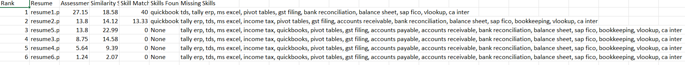
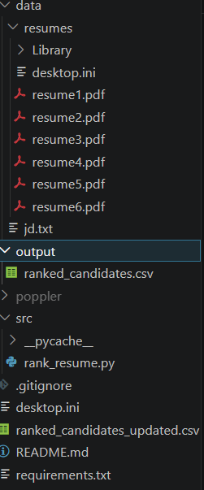

# Resume Ranking System

## 📌 Project Overview
Internship Task-3: An NLP-based system to rank resumes against a Job Description using Python. It uses TF-IDF and Cosine Similarity to calculate match scores and generate a ranked list of candidates.

## 🛠️ Tech Stack
- Python
- Scikit-learn
- PyPDF2
- Pandas

## 📂 Folder Structure
```
Resume-Ranking-System/
├── data/
│   ├── jd.txt                 # Job Description
│   └── resumes/               # 6 Sample Resumes
├── output/
│   └── ranked_candidates.csv  # Final Ranked Results
├── src/
│   └── rank_resume.py         # Main Ranking Script
├── requirements.txt           # Dependencies
└── Resume_Ranking_System_Presentation.pdf
```
## 🚀 How to Run
1. Clone the repository
2. Install dependencies: `pip install -r requirements.txt`
3. Run the script: `python src/rank_resume.py`
4. Check results in `output/ranked_candidates.csv`

## 📊 Output Screenshot

### terminal Execution


### Project structure View

